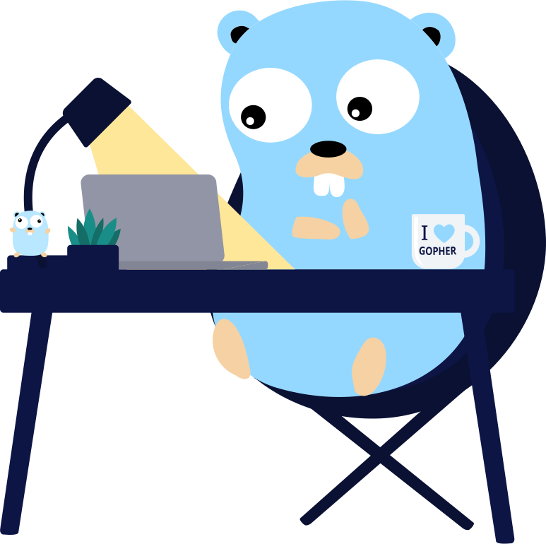

# Golang - Guia de Aprendizado



Este projeto contém notas e dicas de estudo da linguagem Golang.

# Conteúdo

- [Arrays](./arrays/README.md)
- [Channels](./channels/README.md)
- [Embedded Type](./embedded_types/README.md)
- [Interfaces](./interfaces/README.md)
- [Loop](./loop/README.md)
- [Primitives](./primitives/README.md)
- [Type Assertion](./interfaces/type_assertion/README.md)
- [Variáveis & Constants](./var_const/README.md)
- [Variadic](./variadic/README.md)
- [Go Tools](./go_tools/README.md)
- [Style Code](./style_code/README.md)

# Dicas

## `fmt.Printf`

- O verbo `%T` imprime o `data type` da variável e evita a necessidade de usar o pacote `reflect`.

```golang
var d bool
fmt.Printf("var a %T = %+v\n", a, a)
```

# Referências

- [Concurrency in Go: Tools and Techniques for Developers - Katherine Cox-Buday](https://www.amazon.com/Concurrency-Go-Tools-Techniques-Developers/dp/1491941197)
- [Go Code Review Comments](https://go.dev/wiki/CodeReviewComments) - Dicas e convenções seguidas pela comunidade `Go`.
- [Uber Go Style Guide](https://github.com/uber-go/guide/blob/master/style.md) - Um guia de estilos elaborados pelo `Uber`.
- [The Go Programming Language Specification](https://go.dev/ref/spec)
